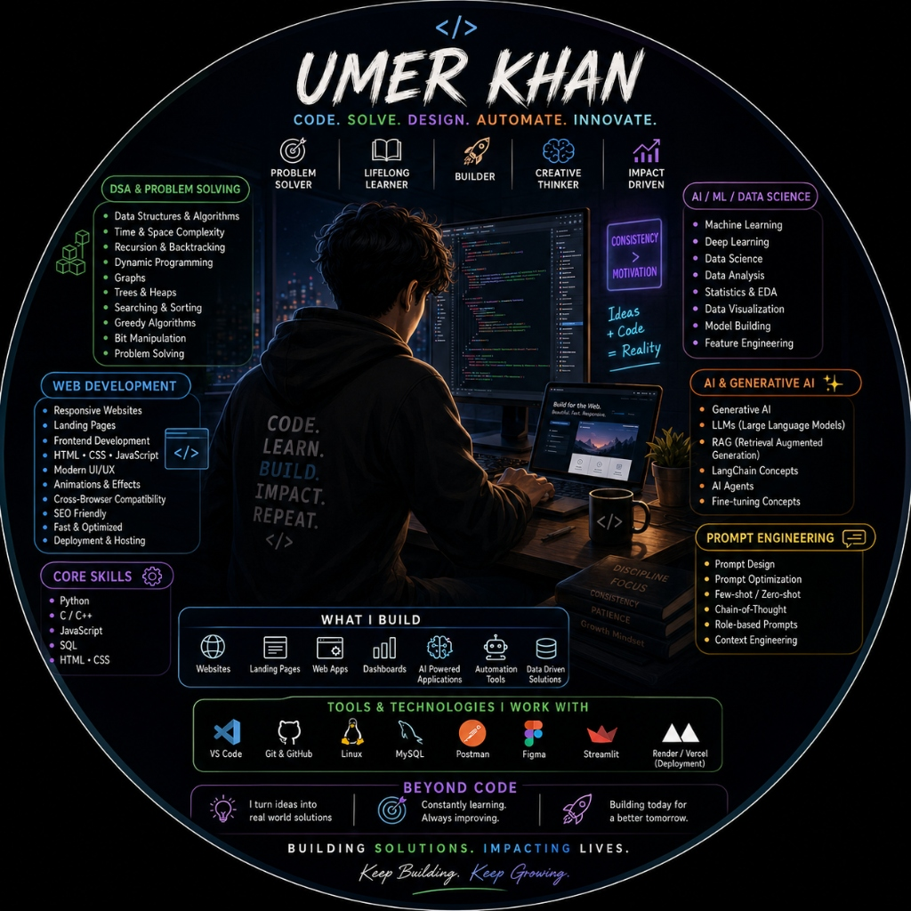

<div align="center">

<!-- Header Banner -->


<!-- Typing SVG Header -->
<a href="https://github.com/uk0976">
  
</a>

<br/><br/>

<p align="center">
  <a href="https://github.com/uk0976">
    
  </a>
  
  
</p>

</div>

<br />

<!-- Developer Infographic -->
<div align="center">
  
</div>

<br />

---

## ⚡  About Me

```javascript
const umer = {
    name: "Umer Khan",
    location: "Mumbai, India 🇮🇳",

    education: {
        degree: "B.E. Artificial Intelligence & Data Science",
        college: "Terna Engineering College",
        diploma: "Artificial Intelligence & Machine Learning (90.33%)"
    },

    role: [
        "AI & Data Science Student",
        "Python Developer",
        "Freelance Developer",
        "AI/ML Enthusiast"
    ],

    currentlyWorkingOn: [
        "Data Structures & Algorithms",
        "LeetCode",
        "Artificial Intelligence",
        "Machine Learning",
        "Generative AI",
        "System Design"
    ],

    code: ["Python", "Java", "JavaScript", "HTML", "CSS", "SQL"],

    motto: "Dream • Code • Build • Repeat ⚡"
};
```

---

## 🚀 What I'm Currently Doing

<table border="0">
  <tr>
    <td width="50%" valign="top">
      <h3>🧩 Problem Solving & Core AI</h3>
      <ul>
        <li><b>Daily LeetCode & DSA</b> practice to master core algorithms</li>
        <li>Building <b>Machine Learning & Deep Learning</b> models</li>
        <li>Designing <b>Generative AI & RAG</b> workflows</li>
      </ul>
    </td>
    <td width="50%" valign="top">
      <h3>🌐 Full-Stack & Engineering</h3>
      <ul>
        <li>Developing responsive <b>Python & Web Applications</b></li>
        <li>Exploring <b>System Design</b> and scalable architectures</li>
        <li>Contributing to <b>Open Source</b> projects</li>
      </ul>
    </td>
  </tr>
</table>

---

## 💻 Tech Stack & Tools

### 🚀 Programming Languages
<p align="left">
  <a href="https://skillicons.dev">
    
  </a>
</p>

### 🤖 Artificial Intelligence & Machine Learning
<p>
  
  
  
  
  
  
  
  
  
  
</p>

### 🌐 Web & UI Development
<p align="left">
  <a href="https://skillicons.dev">
    
  </a>
</p>

### 🔧 Tools, Cloud & Environments
<p align="left">
  <a href="https://skillicons.dev">
    
  </a>
</p>

---

## 🌟 Featured Projects

<table border="0">
  <tr>
    <td width="50%" valign="top">
      <h3 align="center">🏥 MedInsight</h3>
      <p align="center"><b>RAG-Based AI Medical Report Summarizer</b></p>
      <p>AI-powered clinical report summarizer using Retrieval-Augmented Generation, LangChain & BioBERT to simplify complex medical documents.</p>
      <p align="center">
        <a href="https://github.com/uk0976/MedInsight---RAG-Based-AI-Medical-Report-Summarizer"><b>View Repository »</b></a>
      </p>
    </td>
    <td width="50%" valign="top">
      <h3 align="center">📈 StockSage</h3>
      <p align="center"><b>Stock Prediction System & AI ChatBot</b></p>
      <p>Market forecasting platform combining machine learning price predictions, technical indicators, interactive Streamlit dashboards, and an AI bot.</p>
      <p align="center">
        <a href="https://github.com/uk0976/StockSage---Stock-Prediction-System-with-Integrated-ChatBot"><b>View Repository »</b></a>
      </p>
    </td>
  </tr>
  <tr>
    <td width="50%" valign="top">
      <h3 align="center">🚨 NSERS</h3>
      <p align="center"><b>National Smart Emergency Response System</b></p>
      <p>Disaster & emergency response platform built with Google Cloud AI for real-time incident reporting, multimodal verification & dispatch.</p>
      <p align="center">
        <a href="https://github.com/uk0976/NSERS---National-Smart-Emergency-Response-System"><b>View Repository »</b></a>
      </p>
    </td>
    <td width="50%" valign="top">
      <h3 align="center">🧠 Smart Task Scheduler</h3>
      <p align="center"><b>AI-Powered NLP Task Organizer</b></p>
      <p>Intelligent daily productivity scheduler using SpaCy NLP, Python Tkinter, and SQLite for automated task classification & smart reminders.</p>
      <p align="center">
        <a href="https://github.com/uk0976/Smart-Task-Scheduler-with-AI-Integration"><b>View Repository »</b></a>
      </p>
    </td>
  </tr>
</table>

<details>
<summary>📂 <b>Click here to see more projects!</b></summary>
<br/>

- 👤 **[Multiple Face Recognition Attendance System](https://github.com/uk0976/Multiple-Face-Recognition-Attendance-System)**: Haar Cascade & LBPH Algorithm attendance tracker.
- 📚 **[Library Management System](https://github.com/uk0976/Library-Management-System)**: Python Tkinter GUI & MySQL database for book tracking.
- 🎲 **[Snakes & Ladder Game](https://github.com/uk0976/Snakes-and-Ladder-Game)**: Interactive Tkinter board game with AI opponents.
- 🌐 **[Personal Portfolio Website](https://my-portfolio-website-msm1.onrender.com)**: Responsive web portfolio built with HTML, CSS, JS.

</details>

---

## 🏆 Certifications & Achievements

<table border="0">
  <tr>
    <td width="50%" valign="top">
      <h3>📜 Certifications & Honors</h3>
      <ul>
        <li>🎖️ <b>Google Gen AI Exchange Program</b></li>
        <li>🕹️ <b>Google Arcade Participant</b></li>
        <li>⛓️ <b>Blockchain Technology Workshop</b></li>
      </ul>
    </td>
    <td width="50%" valign="top">
      <h3>🏅 Key Achievements</h3>
      <ul>
        <li>📄 <b>Published Research Paper</b> in <i>IJRAR</i></li>
        <li>🥉 <b>3rd Prize</b> - Technical Paper Presentation</li>
        <li>⭐ <b>Best Student Award</b> (Twice) & <b>Best Orator Award</b></li>
      </ul>
    </td>
  </tr>
</table>

---

## 📊 GitHub Analytics & Activity

<div align="center">
  
  
</div>

<br/>

<div align="center">
  
</div>

<br/>

<!-- Quote Card -->
<div align="center">
  
</div>

---

## 🤝 Connect With Me

<p align="center">
  <a href="https://linkedin.com/in/umerkhan04" target="_blank">
    
  </a>
  <a href="https://github.com/uk0976" target="_blank">
    
  </a>
  <a href="mailto:umerkhandoctor04@email.com">
    
  </a>
  <a href="https://my-portfolio-website-msm1.onrender.com" target="_blank">
    
  </a>
</p>

<br/>

<div align="center">
  
</div>
